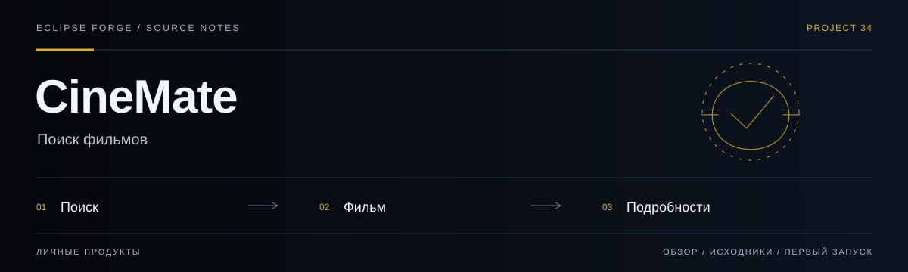

# CineMate



**Поиск фильмов.** Веб-приложение поиска и просмотра информации о фильмах с OMDb.

<!-- repository-guide:start -->
[Первый запуск](#readme-start) · [Что внутри](#readme-map) · [Путеводитель](docs/repository-guide.md#start) · [Карта кода](docs/repository-guide.md#map) · [Проверки](docs/repository-guide.md#checks) · [Границы и права](docs/repository-guide.md#boundaries)

<a id="readme-map"></a>

## Проект за минуту

- **[Поиск и интерфейс](<src/js>)** — Поведение каталога и работа с внешним API.
- **[Данные](<src/data>)** — Локальные ресурсы приложения.
- **[Оформление](<src/css>)** — Стили экранов каталога.

<a id="readme-start"></a>

## Начать локально

**Среда:** Node.js и npm. **Источник:** [package.json](<package.json>).

Из корня клонированного репозитория:

```bash
npm ci
npm run dev
```

Запуск сервера разработки не выполняет публикацию. Проверьте настройки окружения и основной пользовательский сценарий перед выпуском.

<details>
<summary><strong>Перед первым запуском и изменением кода</strong></summary>

- Команды сверены с исходниками 8 сентября 2026. Это инструкция, а не отметка об успешном запуске или текущем production.
- Установка зависимостей может обращаться в registry и выполнять lifecycle scripts. Используйте отдельную рабочую среду и демонстрационные данные.
- Каталог зависит от доступности и лимитов внешнего API; ключ не следует публиковать вместе с демонстрацией.


</details>
<!-- repository-guide:end -->

## Демо

**[Открыть CineMate на GitHub Pages](https://pavelhopson.github.io/cinemate-movie-finder)**

---

## Возможности

- Поиск фильмов с оптимизацией через debounce
- Переключение светлой/темной темы
- Сохранение избранных фильмов в localStorage
- Оффлайн-режим с резервными данными при недоступности API
- Адаптивный дизайн для всех устройств
- Деплой на GitHub Pages (без зависимостей от заблокированных сервисов)

---

## Технологический стек

| Технология | Назначение |
|---|---|
| **Vanilla JS (ES6+)** | Логика приложения без фреймворков |
| **HTML5 / CSS3** | Разметка и стилизация |
| **Vite** | Сборка и dev-сервер |
| **OMDb API** | Источник данных о фильмах |
| **localStorage** | Хранение избранного и настроек темы |
| **GitHub Pages** | Хостинг |

---

## Быстрый старт

### Установка

```bash
git clone https://github.com/PavelHopson/cinemate-movie-finder.git
cd cinemate-movie-finder
npm install
```

### Настройка API-ключа

1. Получите бесплатный ключ на [omdbapi.com/apikey.aspx](https://www.omdbapi.com/apikey.aspx)
2. Скопируйте `.env.example` в `.env`:
   ```bash
   cp .env.example .env
   ```
3. Укажите ваш ключ в `.env`

### Запуск

```bash
npm run dev
```

Откройте в браузере: http://localhost:5173

### Сборка для продакшена

```bash
npm run build
```

### Деплой на GitHub Pages

```bash
npm run deploy
```

---

## Структура проекта

```
cinemate-movie-finder/
├── src/
│   ├── js/           # JavaScript-модули приложения
│   ├── css/          # Стили
│   └── data/         # Резервные данные для оффлайн-режима
├── index.html        # Точка входа
├── package.json
├── .env.example      # Пример переменных окружения
└── LICENSE.md
```

---

## Лицензия

Проект распространяется под лицензией MIT. Подробнее см. [LICENSE.md](LICENSE.md).

## Автор

**Павел Хопсон** — [GitHub](https://github.com/PavelHopson)
